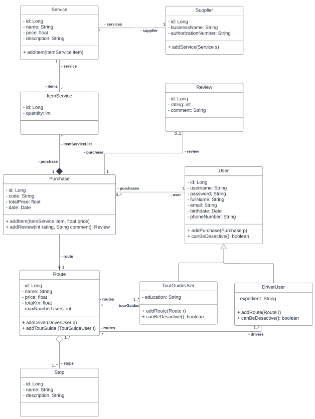

# Viajes turisticos - Tours

Proyecto Backend para la venta de viajes y servicios turisticos, gestión de usuarios, reviews, y proveedores de servicios.

Arquitectura de software:
- Desarrollo del proyecto mediante Maven, framework Spring, ORM Hibernate, y DBMS MySQL.
- Patrón de diseño Repository, divido en: Capa de presentación (Controller), Capa de lógica de negocio (Service), y Capa de acceso a datos (Repository).
- Patrón de diseño para la instanciación del Servicio, como Inyección de dependencias.
- Testing completo para las operaciones ofrecidas por el Servicio.
- Implementación de los servicios mediante HQL y Spring Data JPA.

  

  

  
  
  

  

Modelo lógico Entidad-Relación implementado:

  

---

## NoSQL
Proyectos de investigación e implementacion de consultas sobre Sistemas gestores de bases de datos NoSQL, tales como [MongoDB y Redis](https://github.com/thiago-laurence/buffets/tree/main/nosql).

  
  
  

